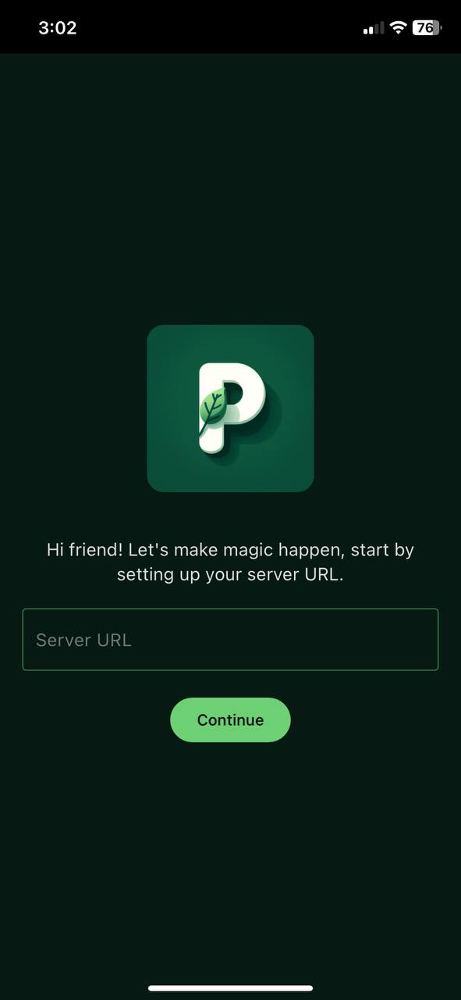
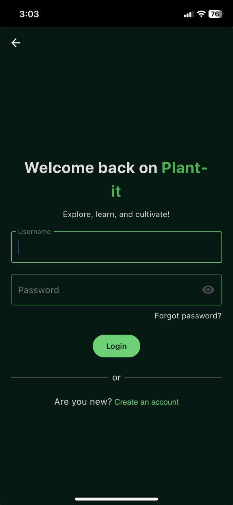
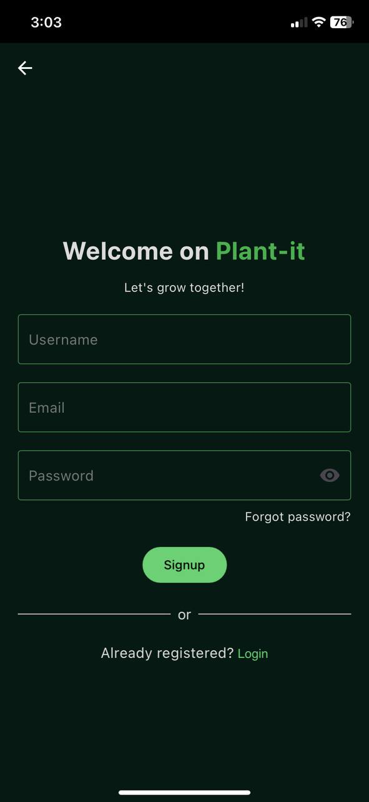

# Use

## Web app
Let's say that you installed and run the server docker image on a machine with IP `192.168.1.5` and you left the default port configuration (i.e. `8080` for the API and `3000` for the frontend). Then in order to use the service:

* Go to `http://192.168.1.5:3000`, you will se a page like the following. Insert `http://192.168.1.5:8080` as server URL and click on "Continue".

{ align=left; loading=lazy; style="height:600px;"}
{ align=left; loading=lazy; style="height:600px;"}

* Now you can login if you already create an account or you can signup.

{ align=left; loading=lazy; style="height:600px;"}
{ align=left; loading=lazy; style="height:600px;"}

* Then you can use the app.
